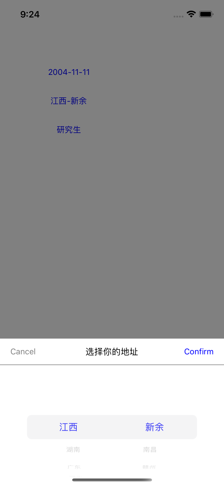
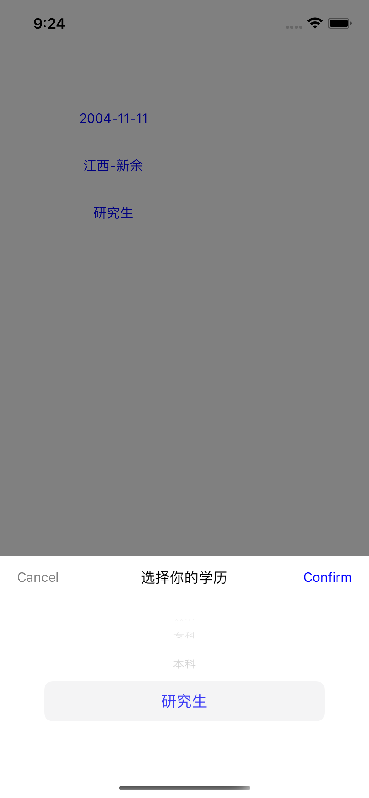

# XXPickerView

[](https://travis-ci.org/coolxinxin/XXPickerView)
[](https://cocoapods.org/pods/XXPickerView)
[](https://cocoapods.org/pods/XXPickerView)
[](https://cocoapods.org/pods/XXPickerView)

## Example

要运行示例项目，下载此项目，然后进入项目根目录，运行“pod install”。

## Requirements

## 安装

XXPickerView 可通过 [CocoaPods](https://cocoapods.org) 获得。 安装
它，只需将以下行添加到您的 Podfile 中：

```ruby
pod 'XXPickerView'
```

## 功能介绍

☑️支持单项选择
☑️支持地址联动选择 继承项目中的ProtocolAddressData
☑️支持日期选择，最小时间，最大时间
☑️修改选中的文字大小，颜色

## 效果图
地址



日期


单项



## Author

coolxinxin, xinxiniscool@gmail.com

## License

XXPickerView is available under the MIT license. See the LICENSE file for more info.
