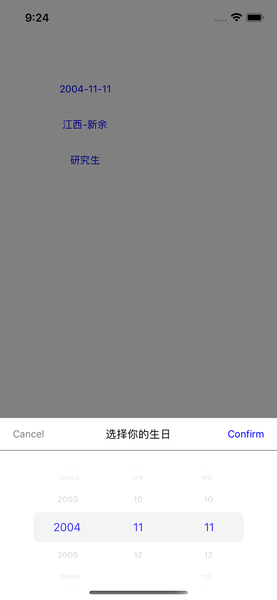

# XXPickerView

[](https://travis-ci.org/coolxinxin/XXPickerView)
<!--[](https://cocoapods.org/pods/XXPickerView)-->
<!--[](https://cocoapods.org/pods/XXPickerView)-->
<!--[](https://cocoapods.org/pods/XXPickerView)-->

## Example

要运行示例项目，下载此项目，然后进入项目根目录，运行“pod install”。

## Requirements

## 安装

因XXPickerView[CocoaPods]已经存在，所以拉取的时候需要带上git地址。 安装
它，只需将以下行添加到您的 Podfile 中：

```ruby
pod 'XXPickerView', :git => "https://github.com/coolxinxin/XXPickerView.git"
```

## 使用示例 [ViewController](https://github.com/coolxinxin/XXPickerView/blob/master/Example/XXPickerView/ViewController.swift)
### 地址
```
var data = Array<AddressData>()
var jxCity = Array<AddressData>()
jxCity.append(AddressData("新余","11"))
jxCity.append(AddressData("南昌","12"))
jxCity.append(AddressData("赣州","13"))
data.append(AddressData("江西","1",jxCity))
AddressPickerView<AddressData,AddressData>(title: "选择你的地址", dataSource: data, selectProvinceCode: “”, selectCityCode: “”, callback: {(province,city) in
    let provinceName = province?.getName() ?? ""
    let cityName = city?.getName() ?? ""
}).show()
```

### 日期
```
DatePickerView(title: "选择你的生日",date:date,dateResultBlock: {date in
    if(date != nil){
       let date = self.dateToString(date!)
    }
}).show()
```

### 单项选择
```
var data = Array<SingleExampleData>()
data.append(SingleExampleData("1", "小学"))
data.append(SingleExampleData("2", "初中"))
data.append(SingleExampleData("3", "高中"))
data.append(SingleExampleData("4", "专科"))
data.append(SingleExampleData("5", "本科"))
data.append(SingleExampleData("6", "研究生"))
SinglePickerView<SingleExampleData>(title: "选择你的学历", dataSource: data, selectCode: "", callback: {result in
    let education = result?.getName() ?? ""
}).show()
```


## 功能介绍

☑️支持单项选择

☑️支持地址联动选择 继承项目中的ProtocolAddressData

☑️支持日期选择，最小时间，最大时间

☑️修改选中的文字大小，颜色

## 效果图
地址


日期



单项


## Author

coolxinxin, xinxiniscool@gmail.com

## License

XXPickerView is available under the MIT license. See the LICENSE file for more info.
